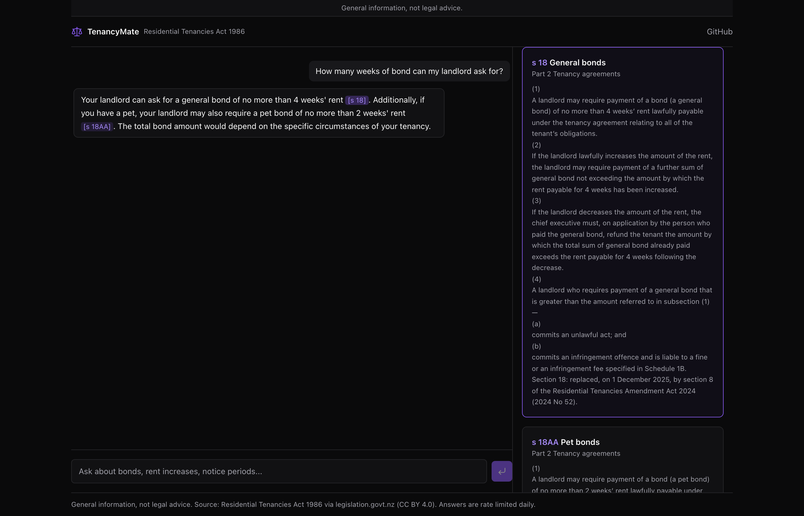
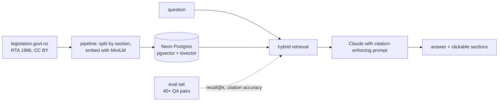

[](https://github.com/R1chi33333/tenancymate/actions/workflows/ci.yml)
[](https://codecov.io/gh/R1chi33333/tenancymate)
[](./LICENSE)

# TenancyMate — NZ tenancy law answers, with the section to prove it

[Live Demo](https://tenancymate.vercel.app) · [Documentation](#getting-started) · [Report Bug](https://github.com/R1chi33333/tenancymate/issues/new?template=bug_report.md)

> General information, not legal advice.



## Why this exists

Tenants and landlords argue about bonds, notice periods and repairs every day, and the answers sit in one public statute nobody reads. TenancyMate answers questions over the Residential Tenancies Act 1986 with section-level citations you can verify in one click. The difference from a toy RAG demo: the retrieval quality is measured against a published evaluation set, and the numbers are in this README.

## Features

- Answers cite sections inline, like [s 23], and clicking one shows the original text
- Hybrid retrieval: pgvector similarity plus Postgres full-text search
- Says "The Act does not directly address this" instead of guessing
- Published eval set and script: retrieval recall at k, citation accuracy
- Rate limited with a daily usage cap to keep the demo affordable
- Standing disclaimer in the interface and in this README: general information, not legal advice

## Architecture



## Tech Stack

Next.js 15 (App Router), TypeScript (strict), Neon Postgres with pgvector, transformers.js (MiniLM embeddings, in the pipeline and in the browser), Vercel AI SDK, Tailwind CSS, Vitest, Playwright.

Generation runs on Groq's free tier (Llama 3.3 70B) so the whole demo costs nothing to operate; the provider sits behind the Vercel AI SDK, so swapping in the Claude API is a one-line change. Query embeddings are computed in the visitor's browser with the same MiniLM that indexed the corpus: the model downloads once (about 25 MB) and the server needs no ML runtime.

## Getting Started

```bash
git clone https://github.com/R1chi33333/tenancymate.git
cd tenancymate
npm ci
cp .env.example .env.local   # database URL and Anthropic API key
npm run pipeline             # fetch, split and embed the Act
npm run dev
```

## Evaluation

```bash
npm run eval   # retrieval recall@k against eval/qa.json
```

45 answerable hand-written questions, each with verified expected sections
([eval/qa.json](./eval/qa.json)). Recall at k is the share of expected
sections appearing among the top-k retrieved chunks' sections. All numbers
below are measured on the same complete corpus.

| configuration                  | recall@3  | recall@6  |
| ------------------------------ | --------- | --------- |
| body chunks, vector only       | 0.500     | 0.633     |
| body chunks, hybrid (RRF)      | 0.522     | 0.633     |
| + heading chunks, vector only  | 0.522     | 0.700     |
| + heading chunks, hybrid (RRF) | **0.567** | **0.700** |

The measured improvement: statutory headings are short plain-language
summaries ("Rent in advance", "Pet bonds"), so indexing each section's
heading as its own chunk lifts recall@6 by 7 points over body-only chunking.

The eval also caught a corpus bug worth recording: the first parser only
matched legislation.govt.nz's older DLM element ids, silently dropping all
74 sections added by recent amendment acts (pet bonds, healthy homes and
more). A live answer citing [s 18AA] failed citation validation because the
section did not exist in the index; the fix grew the corpus from 214 to 288
sections. Grounding checks catch data bugs, not just model mistakes.

## Testing

```bash
npm test               # pipeline and retrieval unit tests
npm run test:coverage  # with coverage report
```

## Roadmap

See [ROADMAP.md](./ROADMAP.md).

## License

[MIT](./LICENSE) for the code. The Act's text remains Crown copyright, reproduced under CC BY 4.0 from legislation.govt.nz.
