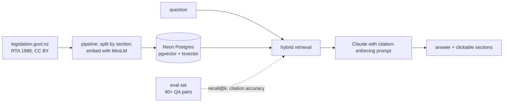

[](https://github.com/R1chi33333/tenancymate/actions/workflows/ci.yml)
[](https://codecov.io/gh/R1chi33333/tenancymate)
[](./LICENSE)

# TenancyMate — NZ tenancy law answers, with the section to prove it

[Live Demo](https://tenancymate.vercel.app) · [Documentation](#getting-started) · [Report Bug](https://github.com/R1chi33333/tenancymate/issues/new?template=bug_report.md)

> General information, not legal advice.

> Status: under active development, pre-v0.1.0.

## Why this exists

Tenants and landlords argue about bonds, notice periods and repairs every day, and the answers sit in one public statute nobody reads. TenancyMate answers questions over the Residential Tenancies Act 1986 with section-level citations you can verify in one click. The difference from a toy RAG demo: the retrieval quality is measured against a published evaluation set, and the numbers are in this README.

## Features

- Answers cite sections inline, like [s 23], and clicking one shows the original text
- Hybrid retrieval: pgvector similarity plus Postgres full-text search
- Says "The Act does not directly address this" instead of guessing
- Published eval set and script: retrieval recall at k, citation accuracy
- Rate limited with a daily usage cap to keep the demo affordable
- Standing disclaimer in the interface and in this README: general information, not legal advice

## Architecture



## Tech Stack

Next.js 15 (App Router), TypeScript (strict), Neon Postgres with pgvector, Claude API, transformers.js (local embeddings), Tailwind CSS, Vitest, Playwright.

## Getting Started

```bash
git clone https://github.com/R1chi33333/tenancymate.git
cd tenancymate
npm ci
cp .env.example .env.local   # database URL and Anthropic API key
npm run pipeline             # fetch, split and embed the Act
npm run dev
```

## Evaluation

```bash
npm run eval   # retrieval recall@k and citation accuracy against eval/qa.json
```

Results will be published here with each release.

## Testing

```bash
npm test               # pipeline and retrieval unit tests
npm run test:coverage  # with coverage report
```

## Roadmap

See [ROADMAP.md](./ROADMAP.md).

## License

[MIT](./LICENSE) for the code. The Act's text remains Crown copyright, reproduced under CC BY 4.0 from legislation.govt.nz.
